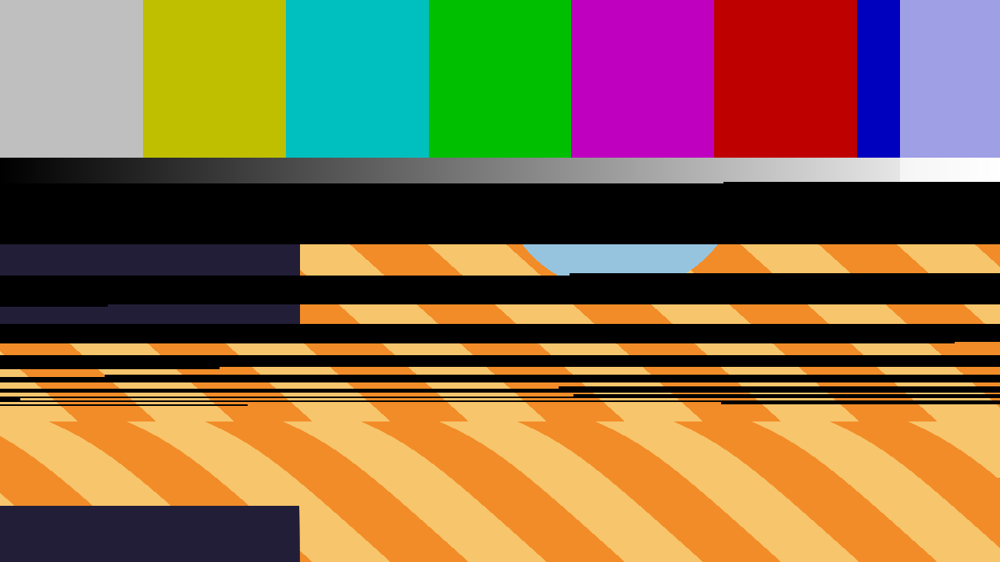

# Relay

> **AI-assisted project.** This codebase was created with [Claude](https://claude.com/claude-code)
> (Anthropic), directed and reviewed by a human author. The relay is not
> asserted but measured: an offline harness drives the real plugin class in a
> headless GL context with **two** input textures at two different resolutions
> and checks each claim against a closed form — the switching frame's bands at
> the scanlines the bounce schedule predicts, every pixel away from a cut
> **exactly** right and each event seen within one line's blanking of when it
> happened; the coil switching at Pull-in on the way up and at Drop-out on the
> way down, **41 of 41 frames bitwise**; the re-lock following the second-order
> step response to **0.002 rows** over 150 frames with the log decrement and the
> zero crossing read off the picture; the crosstalk doubling per octave to
> **0.013** (see [Status](#status)). It has **never been loaded into Resolume**.
> It is the fleet's third FFGL *mixer*, built to what the first two, genlock and
> wipe, measured in Arena. Check it in your own rig before trusting it in a show.

An A/B cut made by a relay — bounce and all — as an FFGL **mixer** for
[Resolume](https://resolume.com) Arena and Avenue.



<sub>The repo's two test cards through the plugin on the frame the switch
lands on — Operate Time 6 ms, Bounce Time 2 ms, Restitution 0.63 — rendered
by `rltest`, the offline harness, not captured from Resolume. The upper part
of the picture was scanned while the relay was still on A; the black bands are
the open contact in flight; the picture below each is B, arriving — and
rolled, because the monitor has not pulled B's field phase in yet.</sub>

## A relay is a coil, an armature and two contacts

A cheap video switcher — a SCART box, an old routing switcher — cuts with a
relay. Each of its parts does something to the picture, because a video frame
is scanned in time and a relay's events happen in milliseconds, about fifteen
lines each:

- **The coil has hysteresis.** It pulls in at one voltage and drops out at a
  much lower one. The input named `Opacity` is the coil voltage, and Resolume
  binds a mixer's `Opacity` to the layer's opacity fader — so the fader cuts to
  B high on the way up and back to A low on the way down, and nothing in
  between is a dissolve.
- **The contacts bounce.** When the armature moves, the moving contact leaves
  A (the output is open: no signal, black), flies to B, hits, rebounds and
  hits again, each bounce shorter than the last by the coefficient of
  restitution. The frame the switch lands on shows **horizontal bands** of A,
  black and B at the scanlines set by the bounce times, cut mid-line at the
  pixel where the contact landed.
- **The receiver re-locks.** If the two sources are not genlocked, the new
  source's field timing is somewhere else. The monitor's vertical PLL pulls it
  in as a second-order step response, so the picture rolls and settles,
  overshooting if the loop is underdamped, and the line PLL tears the first
  lines after the seam.
- **Crosstalk.** The open contact is a small capacitor, so the unselected
  input leaks through it high-passed, rising 6 dB an octave: its edges ghost
  faintly into the selected picture.

A good router switches in the vertical interval, and `Switch Point` set to
Vert Interval is that cure: the break waits for the blanking before the next
field, so the bounce lands at the top of the frame and, with a short enough
bounce, nowhere.

**It is a mixer, not an effect.** It needs a layer below it: that layer is A,
and the clip on this layer is B, which the energised coil selects.

## The controls

**Raster** — Standard (PAL or NTSC: the line period and the active line count
the host frame is scanned as) and Switch Point (Anywhere, or Vert Interval).
Standard is first on purpose: Resolume Arena does not show a mixer's first
parameter (measured on genlock and wipe), so index 0 holds the one control
whose default — PAL — is right if nobody can ever reach it.

**Coil** — Opacity, Pull-in, Drop-out, Operate Time (0–40 ms from the
threshold to the contact leaving its rest), Select and Take. **Opacity is the
coil voltage**: it is named Opacity on purpose, because Resolume binds a mixer
parameter of that name to the **layer's opacity fader**, so the layer's own
fader drives the relay. Select (a switch) and Take (a button) invert what an
energised coil selects, for a host without that binding.

**Contacts** — Bounce Time (the first bounce, 0–4 ms), Restitution (0–0.9:
each bounce is the last times this) and Open Level (what an open contact
shows; black by default).

**Sync** — Genlocked (off: the new source's field is Phase Offset fields away
and the monitor has to pull it in), Phase Offset, Lock Time (the loop's
natural period, 0.05–2 s) and Damping (0.1–2: below 1 it rings).

**Crosstalk** — Crosstalk (the leak at the corner) and Corner (0.25–4 MHz in
the signal's own frequency; below it the leak falls 6 dB an octave).

## Build

Needs CMake and the Resolume FFGL SDK, which is a submodule.

```bash
git clone --recursive https://github.com/stoatworks-labs/relay
cd relay
cmake -B build -DCMAKE_BUILD_TYPE=Release
cmake --build build
cmake --install build    # → ~/Documents/Resolume Arena/Extra Effects
```

macOS builds universal (arm64 + x86_64) by default. Add
`-DCMAKE_OSX_ARCHITECTURES=arm64` for a faster development build.

The install path is **Extra Effects**, although this is a mixer. Resolume has
one FFGL folder, and sources, effects and mixers all load from it: genlock and
wipe, the fleet's first two mixers, were loaded from there by Resolume Arena
7.27.1 and offered as a layer's Blend Mode.

## Building and testing

The harness renders the real plugin class headlessly, with **two** inputs —
`--input-a` is A, the layer below; `--input-b` is B, this layer — which may be
different sizes, with different hardware padding, rendered to a third size.

    ./build/rltest --out /tmp/frame.png     both cards, through the plugin
    ./build/rltest --list                   every parameter, kind and default
    ./build/rltest --mixer                  two inputs, two MaxUVs, and the guards
    ./build/rltest --ends                   at rest A and B come back bitwise, alpha included
    ./build/rltest --hysteresis             up at Pull-in, down at Drop-out; Select and Take
    ./build/rltest --bounce                 the switching frame's bands, PAL and NTSC
    ./build/rltest --vi                     Vertical Interval puts every cut at the top
    ./build/rltest --relock                 the roll is the second-order step response
    ./build/rltest --crosstalk              the leak doubles per octave below the corner
    ./build/rltest --mutation               one character of the shipped GLSL fails --bounce
    ./build/rltest --bench                  720p through 4K, at rest and with Crosstalk on
    ./build/rltest --pipe --pipe-src F      two raw RGBA streams in, frames out (filming, not a check)
    python3 tools/sweep.py                  no control is silently dead
    tools/verify.sh                         all of it, on a fresh universal build

Every check runs at **two rasters**, 640×360 and 320×180, on this Mac's GPU
**and** on Apple's software renderer, and every tolerance is derived from
something physical — one pixel's scan time, one line's blanking, the GL spec's
1 part in 10^5 on an interpolated coordinate, a float sum's rounding — rather
than from the number this machine printed first. Each check carries a
**negative control**, shipped in the plugin as a fault switch the harness can
throw: the bounce timed in frames, a first-order loop, a flat leak, a coil with
no hysteresis, one MaxUV for both inputs. [AGENTS.md](AGENTS.md) lists every
number and where it comes from.

## Status

**v0.1.0, and honestly early.** Verified by measurement on an Apple M4 Max,
macOS 26.4.1, 2026-09-24, at 640×360 **and** 320×180 unless stated, on the GPU
and on Apple's software renderer:

| Check | Result |
| --- | --- |
| Two inputs, two sizes, two MaxUVs | A 200×120 of 256×256, B 96×70 of 128×128, out 320×200: **0 padding pixels** reached the picture at rest or on a switching frame, every quadrant within **0.000 of 255**, the marker within one source texel |
| The missing-input guards | a null input array, zero inputs, one input, a null A and a null B all return `FF_FAIL` without crashing |
| At rest | Opacity 0 is A and 1 is B, **bitwise in all four channels**, on cards whose alpha is not 255 everywhere, with bounce, operate, open level and phase all set; and after a switch with the monitor rolling, **113 frames** later the roll is exactly zero and B is bitwise again |
| Hysteresis | Pull-in 0.725 / Drop-out 0.275: up switches at 0.75, down at 0.25, **41 of 41 frames** the predicted card bitwise; Drop-out above Pull-in drops at the pull-in; Select and Take swap the two bitwise, and a held Take counts once |
| Bounce | Operate 4 ms, Bounce 2 ms, e 0.6, PAL and NTSC: **every pixel** away from a cut is what the schedule says (0 wrong), rows that share a line cut at the same pixel, all **16 contact events** seen within **12 µs** of when they happened at 360 rows (a line's blanking) and 76 µs at 180 (a skipped line more); successive open flights shrink by e; the bounce lasts **4.860 ms** of the closed form's 5.000 (t₁/(1−e)), the 0.14 ms difference being the tail under one line |
| Vertical Interval | Operate 0, 3, 9.7 and 16 ms: the switch lands on the predicted frame, **no A anywhere** in it, and with no bounce it is B bitwise |
| Re-lock | ζ 0.447, ωn 19.9 rad/s: 150 frames follow the closed-form step response to **0.0020 rows** (tolerance 0.02); the first zero crossing at 0.1167 s against the loop's 0.1145; the log decrement between the first two extremes **1.565** against π ζ/√(1−ζ²) = 1.571; ζ 2: creeps in without overshoot, 0.0020 rows |
| Crosstalk | corner 1 MHz (52 cycles/width at PAL): at 2, 4, 8, 16 and 32 cycles/width the leak is the stated filter's to **1.6e-7 relative**, either input leaking; 2→4→8 cycles doubles per octave to within **0.0106** of 2 (the stated filter's own departure is 0.0119); Crosstalk 0 is bitwise |
| Mutation | one character of the shipped GLSL — the line mapping dividing by the width instead of the height — fails **3** `--bounce` assertions; the shipped text through the same hook passes and renders the default path's bytes. By hand: `uv.x >= c.y` → `<=` fails **12** `--bounce` assertions and nothing else |
| Negative controls | every one fails its check: shared MaxUV (4 assertions), no hysteresis, bounce in frames (2), first-order loop (4), flat leak (3), Anywhere at 9.7 ms leaving A at the top |
| No dead controls | all **17** sweepable of the 21 parameters change the picture at 480×270; the other four are the About block |
| Pipe | 3 frames in, 3 out; Opacity ramps and Select steps between cues; a closed stdout is **exit 1** |
| macOS binary | universal (`x86_64 arm64`), exports `plugMain`, ad-hoc signs |
| Host metadata | `oxbow probe` reads **SW Relay / RL01 / mixer / inputs 2..2**, parameter 0 **Standard** |
| Render cost | **0.03 ms/frame at 720p, 0.04 at 1080p, 0.11 at 4K** at rest (0.7% of a 60 fps frame); with Crosstalk on **0.05 at 1080p, 0.13 at 4K**, worst of several runs |

Run `tools/verify.sh` before believing any of it.

**Not done, and the list is honest.** Relay has **never been loaded into
Resolume** on either platform. What it is built to — Extra Effects, a layer's
Blend Mode, both inputs padded, `SetTime` every frame in milliseconds,
`Opacity` bound to the layer's fader, the first parameter hidden — was measured
on genlock and wipe in Arena 7.27.1 and not re-measured on Relay. CI has never
run and the Windows DLL has never been compiled. Nothing has run on a **GPU
other than this Mac's** or on llvmpipe. The line PLL's tear is a look, not a
model, and nothing measures it. The dwell fraction of a bounce (half of each
interval closed) and the approach flight (as long as the first bounce) are
model constants, not measurements of any relay. There is **no user guide**, no
presets, no OpenFX port and no browser demo.

[AGENTS.md](AGENTS.md) has the full list of what is assumed rather than
measured, the open questions, and the traps.

<!-- attributions:start -->
This project is built on other people's work — see [ATTRIBUTIONS.md](ATTRIBUTIONS.md).
<!-- attributions:end -->

## Licence

MIT — see [LICENSE](LICENSE).
