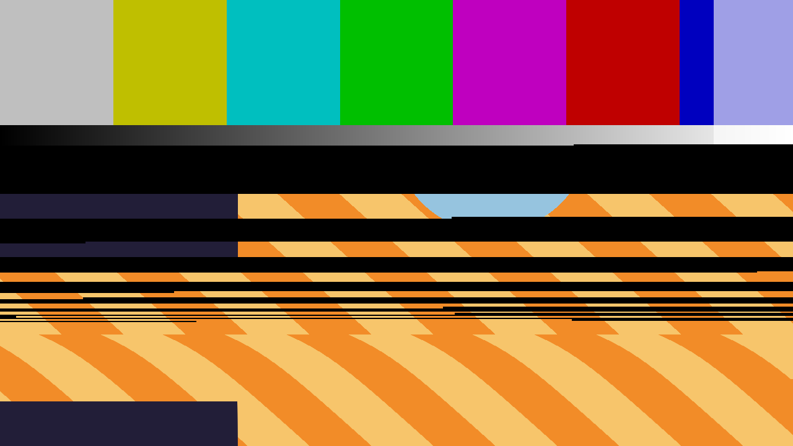
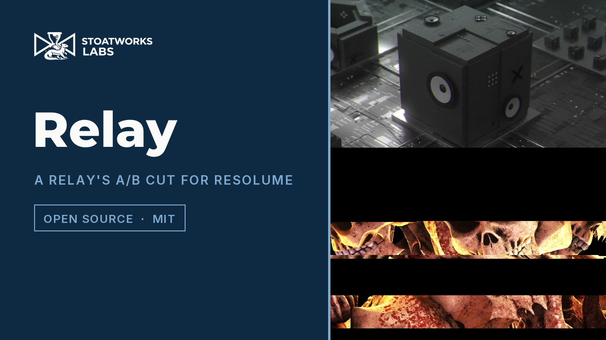

# Relay

> **AI-assisted project.** This codebase was created with [Claude](https://claude.com/claude-code)
> (Anthropic), directed and reviewed by a human author. The relay is not
> asserted but measured: an offline harness drives the real plugin class in a
> headless GL context with **two** input textures at two different resolutions
> and checks each claim against a closed form — the switching frame's bands at
> the scanlines the bounce schedule predicts, every pixel away from a cut
> **exactly** right and each event seen within one line's blanking of when it
> happened; the coil switching at Pull-in on the way up and at Drop-out on the
> way down, **41 of 41 frames bitwise**; the re-lock following the second-order
> step response to **0.002 rows** over 150 frames with the log decrement and the
> zero crossing read off the picture; the crosstalk doubling per octave to
> **0.013** (see [Status](#status)). It has **never been loaded into Resolume on
> macOS**; on Windows it has run in Resolume Arena 7.27.1, on software rendering,
> as a layer's Blend Mode. It is the fleet's third FFGL *mixer*, after genlock and
> wipe. The [OpenFX build](#openfx--resolve-vegas-nuke-natron) is a transition: it
> agrees with the FFGL build to **one 8-bit code** in a test host, and it has run
> as a transition in **DaVinci Resolve Studio 21.1** on macOS (the switch at the
> midpoint, the bounce and the roll, and a last frame that is exactly the
> incoming clip); never in Vegas, Nuke or Natron.
> Check it in your own rig before trusting it in a show.

An A/B cut made by a relay — bounce and all — as an FFGL **mixer** for
[Resolume](https://resolume.com) Arena and Avenue, and as an OpenFX
**transition** for DaVinci Resolve and Vegas.



<sub>The repo's two test cards through the plugin on the frame the switch
lands on — Operate Time 6 ms, Bounce Time 2 ms, Restitution 0.63 — rendered
by `rltest`, the offline harness, not captured from Resolume. The upper part
of the picture was scanned while the relay was still on A; the black bands are
the open contact in flight; the picture below each is B, arriving — and
rolled, because the monitor has not pulled B's field phase in yet.</sub>

[](https://www.youtube.com/watch?v=NRwl0iCd7_g)

*[Watch it](https://www.youtube.com/watch?v=NRwl0iCd7_g) — 53 seconds:
the fader up past Pull-in and the cut to B with its roll, the switching frame
held so the bands of A, black and B can be read, the fader down past Drop-out,
a longer livelier bounce, an underdamped re-lock, genlocked vertical-interval
cuts, and crosstalk with three Take presses. Every frame is the real plugin's
output: an FFGL plugin has no window, so the footage is rendered by this
repository's own offline harness (`rltest --pipe`, driven by a cue sheet)
rather than filmed off a screen, the clips are Resolume's bundled demo media,
and the two held frames are stills of frames the plugin rendered.*

<!-- downloads:start -->

## Download

**[v0.2.0](https://github.com/stoatworks-labs/relay/releases/tag/v0.2.0)** — prebuilt for macOS, Windows and Linux. Pick your platform:

<details>
<summary><b>macOS</b> — Universal (Apple Silicon + Intel)</summary>

| Build | Download | Size |
| --- | --- | --- |
| Universal (Apple Silicon + Intel) · .dmg disk image | [`relay-0.2.0-macos-universal.dmg`](https://github.com/stoatworks-labs/relay/releases/download/v0.2.0/relay-0.2.0-macos-universal.dmg) | 230 KB |
| Universal (Apple Silicon + Intel) · .zip archive | [`relay-macos-universal.zip`](https://github.com/stoatworks-labs/relay/releases/latest/download/relay-macos-universal.zip) | 185 KB |
| Universal (Apple Silicon + Intel) · .zip archive (OpenFX — Resolve, Vegas, Nuke) | [`relay-ofx-macos-universal.zip`](https://github.com/stoatworks-labs/relay/releases/latest/download/relay-ofx-macos-universal.zip) | 261 KB |

</details>

<details>
<summary><b>Windows</b> — x64</summary>

| Build | Download | Size |
| --- | --- | --- |
| x64 · .exe installer | [`relay-0.2.0-windows-x86_64-setup.exe`](https://github.com/stoatworks-labs/relay/releases/download/v0.2.0/relay-0.2.0-windows-x86_64-setup.exe) | 224 KB |
| x64 · .zip archive | [`relay-windows-x86_64.zip`](https://github.com/stoatworks-labs/relay/releases/latest/download/relay-windows-x86_64.zip) | 111 KB |
| x64 · .zip archive (OpenFX — Resolve, Vegas, Nuke) | [`relay-ofx-windows-x86_64.zip`](https://github.com/stoatworks-labs/relay/releases/latest/download/relay-ofx-windows-x86_64.zip) | 76 KB |

</details>

<details>
<summary><b>Linux</b> — x64</summary>

| Build | Download | Size |
| --- | --- | --- |
| x64 · .zip archive (OpenFX — Resolve, Vegas, Nuke) | [`relay-ofx-linux-x86_64.zip`](https://github.com/stoatworks-labs/relay/releases/latest/download/relay-ofx-linux-x86_64.zip) | 713 KB |

</details>

All builds, checksums and release notes: [github.com/stoatworks-labs/relay/releases](https://github.com/stoatworks-labs/relay/releases).

macOS builds are signed and notarised and open normally. The Windows builds are unsigned, so SmartScreen warns once.

<!-- downloads:end -->

## A relay is a coil, an armature and two contacts

A cheap video switcher — a SCART box, an old routing switcher — cuts with a
relay. Each of its parts does something to the picture, because a video frame
is scanned in time and a relay's events happen in milliseconds, about fifteen
lines each:

- **The coil has hysteresis.** It pulls in at one voltage and drops out at a
  much lower one. The input named `Opacity` is the coil voltage, and Resolume
  binds a mixer's `Opacity` to the layer's opacity fader — so the fader cuts to
  B high on the way up and back to A low on the way down, and nothing in
  between is a dissolve.
- **The contacts bounce.** When the armature moves, the moving contact leaves
  A (the output is open: no signal, black), flies to B, hits, rebounds and
  hits again, each bounce shorter than the last by the coefficient of
  restitution. The frame the switch lands on shows **horizontal bands** of A,
  black and B at the scanlines set by the bounce times, cut mid-line at the
  pixel where the contact landed.
- **The receiver re-locks.** If the two sources are not genlocked, the new
  source's field timing is somewhere else. The monitor's vertical PLL pulls it
  in as a second-order step response, so the picture rolls and settles,
  overshooting if the loop is underdamped, and the line PLL tears the first
  lines after the seam.
- **Crosstalk.** The open contact is a small capacitor, so the unselected
  input leaks through it high-passed, rising 6 dB an octave: its edges ghost
  faintly into the selected picture.

A good router switches in the vertical interval, and `Switch Point` set to
Vert Interval is that cure: the break waits for the blanking before the next
field, so the bounce lands at the top of the frame and, with a short enough
bounce, nowhere.

**It is a mixer, not an effect.** It needs a layer below it: that layer is A,
and the clip on this layer is B, which the energised coil selects.

**[Try it in your browser](https://relay-demo.stoatworks-labs.com)** — the
plugin's own shader in WebGL2 with its coil, bounce schedule, raster mapping,
re-lock and crosstalk filter ported to JavaScript, switching between two
generated clips. A port, not the plugin: the page lists everything it does
not reproduce, starting with the fact that in Resolume the coil voltage is the
layer's opacity fader.

## The controls

**Raster** — Standard (PAL or NTSC: the line period and the active line count
the host frame is scanned as) and Switch Point (Anywhere, or Vert Interval).
Standard is first on purpose: Resolume Arena does not show a mixer's first
parameter (measured on genlock and wipe), so index 0 holds the one control
whose default — PAL — is right if nobody can ever reach it.

**Coil** — Opacity, Pull-in, Drop-out, Operate Time (0–40 ms from the
threshold to the contact leaving its rest), Select and Take. **Opacity is the
coil voltage**: it is named Opacity on purpose, because Resolume binds a mixer
parameter of that name to the **layer's opacity fader**, so the layer's own
fader drives the relay. Select (a switch) and Take (a button) invert what an
energised coil selects, for a host without that binding.

**Contacts** — Bounce Time (the first bounce, 0–4 ms), Restitution (0–0.9:
each bounce is the last times this) and Open Level (what an open contact
shows; black by default).

**Sync** — Genlocked (off: the new source's field is Phase Offset fields away
and the monitor has to pull it in), Phase Offset, Lock Time (the loop's
natural period, 0.05–2 s) and Damping (0.1–2: below 1 it rings).

**Crosstalk** — Crosstalk (the leak at the corner) and Corner (0.25–4 MHz in
the signal's own frequency; below it the leak falls 6 dB an octave).

## OpenFX — Resolve, Vegas, Nuke, Natron

The same relay also builds as an OpenFX plugin — as a **transition**, because
that is what a cut between two clips is on a timeline. Put **Relay** (under
*Stoatworks*) between two clips in DaVinci Resolve or Vegas Pro: the outgoing
clip (`SourceFrom`) is A, the incoming one (`SourceTo`) is B, and the
transition's own progress — 0 at its start, 1 at its end — is the coil voltage.
So the relay cuts where the progress passes Pull-in — half way through by
default, the edit point of a centred transition — with the bounce, the roll
and the crosstalk of the Resolume build, and over the last 15% of the
transition fades to exactly the incoming clip so the roll does not pop. It
declares the Transition context only, so it appears wherever a host offers
OpenFX transitions and nowhere else; whether Nuke or Natron list it has not
been checked.

The OpenFX build ships from **v0.2.0**, as its own zip beside the Resolume
downloads: `relay-ofx-macos-universal.zip`, `relay-ofx-windows-x86_64.zip`
and `relay-ofx-linux-x86_64.zip` on the
[release page](https://github.com/stoatworks-labs/relay/releases). Copy
`Relay.ofx.bundle` from the one for your platform into the standard OpenFX
folder, then restart the host:

```
macOS    /Library/OFX/Plugins/
Windows  C:\Program Files\Common Files\OFX\Plugins\
Linux    /usr/OFX/Plugins/
```

It is the same relay, not a lookalike: the coil, the bounce schedule, the
raster mapping, the re-lock and the crosstalk filter are the same C++ the
Resolume build runs, and the per-pixel pass is the shader transcribed line for
line. Hosted in a test host, the plugin's frames agree with the Resolume
build's GPU render of the same cards to **one 8-bit code** (see
[Status](#status)).

**What is different from the Resolume build, and why:**

- **No Opacity.** The host's transition progress is the coil voltage. Resolume
  binds the mixer's Opacity to the layer's fader; a timeline has the
  transition's progress instead.
- **Pull-in defaults to 0.5, not 0.7.** In Resolume Pull-in is a fader
  position, and 0.7 makes the coil pull in high on the way up. On a timeline
  it is where in the transition the cut lands: at 0.7 it was 70% of the way
  through, and in DaVinci Resolve 21.1 a one-second transition was still
  rolling on its last frame (6.4% of the picture not yet the incoming clip)
  and popped to the clean clip on the next. At 0.5 the relay switches at the
  edit point and has half the transition to settle in.
- **No memory, and none needed.** In Resolume the plugin remembers when the
  coil last moved and carries the bounce and the roll from frame to frame. An
  OpenFX host renders frames in any order, alone and on several threads, so
  each frame reads the transition's progress back from the start of the
  transition, finds where it crossed Pull-in — to a fraction of a frame, where
  Resolume, which reads its fader once a frame, can only know which frame —
  and works the bounce and the roll out from there in closed form. Any frame
  renders on its own, and the same frame always renders the same.
- **Hysteresis on a timeline.** Pull-in is where the rising progress cuts to
  SourceTo. Drop-out matters only if the progress comes back down — a reversed
  or a keyframed transition — and then the relay cuts back to SourceFrom where
  the progress reaches Drop-out, not where it re-crosses Pull-in. A transition
  that starts above Pull-in (a reversed one) starts on SourceTo with no switch,
  as the Resolume build does on its first frame.
- **Select and Take are one fixed choice.** Take is a momentary button in
  Resolume and has no meaning on a timeline; here `Select` picks which clip
  the relay rests on — *From, then To* (the default) or *To, then From*.
- **Standard, Switch Point, Select and Genlocked do not animate.** They describe
  the installation, not the cut. Every other control can be keyframed, and a
  frame is worked out as if the relay had always had that frame's settings.
- **A crossing during a frame's own scan cuts that frame.** The progress is
  read to the end of the frame being scanned, so a cut lands on the line the
  scan had reached when the contact moved. Resolume reads its fader at each
  frame's start, so the FFGL build shows the same cut a frame later.
- **The transition has Ends; the mixer has none.** Half a one-second transition
  is not enough for the re-lock: at the defaults the picture rolls by more
  than half a row (at 1080p) for 0.63–0.67 s after the switch at 24, 25 and
  30 fps, and the roll is not exactly zero for 1.75–1.78 s. So with **Ends** on
  **Fade**, the default, the last **End Length** of the transition (0.15)
  crossfades — a smoothstep, in premultiplied colour — from the relay to
  exactly SourceTo, and the transition's last frame is the incoming clip
  bitwise. The end is judged one frame ahead, because a host's last frame of a
  transition need not reach progress 1 (Resolve's did not). **Cut** is the
  relay to the last frame, and whatever it is doing is cut off there — the
  first OpenFX build, bit for bit. The same names, options and defaults as
  the lenticular and pilot transitions; only the end is faded, because the
  start is the relay at rest on SourceFrom already.
- **A host that reports no frame rate** is taken as 24 fps. Resolve's Fusion
  page reports the frame rate on the effect but not on its clips, and Relay
  reads the effect's. Fusion has no transition slot, but Relay does load as a
  Fusion tool, with Transition as an ordinary control that has to be
  animated. Keyed 0→0.6 and then held, it showed plain SourceTo there where
  the test host shows the coil moving — not yet understood.

## Build

Needs CMake and the Resolume FFGL SDK, which is a submodule.

```bash
git clone --recursive https://github.com/stoatworks-labs/relay
cd relay
cmake -B build -DCMAKE_BUILD_TYPE=Release
cmake --build build
cmake --install build    # → ~/Documents/Resolume Arena/Extra Effects
```

macOS builds universal (arm64 + x86_64) by default. Add
`-DCMAKE_OSX_ARCHITECTURES=arm64` for a faster development build.

The same build makes the OpenFX bundle, `build/Relay.ofx.bundle`; copy it to
the OpenFX folder above. `-DBUILD_OFX=OFF` leaves it out, and
`-DRELAY_BUILD_FFGL=OFF` builds it alone with nothing but a compiler — no FFGL
SDK and no GL loader, which is how the Linux build is made.

The install path is **Extra Effects**, although this is a mixer. Resolume has
one FFGL folder, and sources, effects and mixers all load from it: genlock and
wipe, the fleet's first two mixers, were loaded from there by Resolume Arena
7.27.1 and offered as a layer's Blend Mode.

## Building and testing

The harness renders the real plugin class headlessly, with **two** inputs —
`--input-a` is A, the layer below; `--input-b` is B, this layer — which may be
different sizes, with different hardware padding, rendered to a third size.

    ./build/rltest --out /tmp/frame.png     both cards, through the plugin
    ./build/rltest --list                   every parameter, kind and default
    ./build/rltest --mixer                  two inputs, two MaxUVs, and the guards
    ./build/rltest --ends                   at rest A and B come back bitwise, alpha included
    ./build/rltest --hysteresis             up at Pull-in, down at Drop-out; Select and Take
    ./build/rltest --bounce                 the switching frame's bands, PAL and NTSC
    ./build/rltest --vi                     Vertical Interval puts every cut at the top
    ./build/rltest --relock                 the roll is the second-order step response
    ./build/rltest --crosstalk              the leak doubles per octave below the corner
    ./build/rltest --mutation               one character of the shipped GLSL fails --bounce
    ./build/rltest --transition             the OpenFX build against this one, frame by frame
    ./build/rltest --bench                  720p through 4K, at rest and with Crosstalk on;
                                            the GPU, then the OpenFX build's C++ pass
    ./build/rltest --pipe --pipe-src F      two raw RGBA streams in, frames out (filming, not a check)
    python3 tools/sweep.py                  no control is silently dead
    tools/verify.sh                         all of it, on a fresh universal build

Every check runs at **two rasters**, 640×360 and 320×180, on this Mac's GPU
**and** on Apple's software renderer, and every tolerance is derived from
something physical — one pixel's scan time, one line's blanking, the GL spec's
1 part in 10^5 on an interpolated coordinate, a float sum's rounding — rather
than from the number this machine printed first. Each check carries a
**negative control**, shipped in the plugin as a fault switch the harness can
throw: the bounce timed in frames, a first-order loop, a flat leak, a coil with
no hysteresis, one MaxUV for both inputs. [AGENTS.md](AGENTS.md) lists every
number and where it comes from.

## Status

**v0.2.0, and honestly early.** v0.2.0 adds the OpenFX transition build; the
Resolume mixer is unchanged from v0.1.0. Verified by measurement on an Apple
M4 Max, macOS 26.4.1, 2026-09-24 (the OpenFX rows 2026-10-03 and 10-04), at
640×360 **and** 320×180 unless stated, on the GPU and on Apple's software
renderer:

| Check | Result |
| --- | --- |
| Two inputs, two sizes, two MaxUVs | A 200×120 of 256×256, B 96×70 of 128×128, out 320×200: **0 padding pixels** reached the picture at rest or on a switching frame, every quadrant within **0.000 of 255**, the marker within one source texel |
| The missing-input guards | a null input array, zero inputs, one input, a null A and a null B all return `FF_FAIL` without crashing |
| At rest | Opacity 0 is A and 1 is B, **bitwise in all four channels**, on cards whose alpha is not 255 everywhere, with bounce, operate, open level and phase all set; and after a switch with the monitor rolling, **113 frames** later the roll is exactly zero and B is bitwise again |
| Hysteresis | Pull-in 0.725 / Drop-out 0.275: up switches at 0.75, down at 0.25, **41 of 41 frames** the predicted card bitwise; Drop-out above Pull-in drops at the pull-in; Select and Take swap the two bitwise, and a held Take counts once |
| Bounce | Operate 4 ms, Bounce 2 ms, e 0.6, PAL and NTSC: **every pixel** away from a cut is what the schedule says (0 wrong), rows that share a line cut at the same pixel, all **16 contact events** seen within **12 µs** of when they happened at 360 rows (a line's blanking) and 76 µs at 180 (a skipped line more); successive open flights shrink by e; the bounce lasts **4.860 ms** of the closed form's 5.000 (t₁/(1−e)), the 0.14 ms difference being the tail under one line |
| Vertical Interval | Operate 0, 3, 9.7 and 16 ms: the switch lands on the predicted frame, **no A anywhere** in it, and with no bounce it is B bitwise |
| Re-lock | ζ 0.447, ωn 19.9 rad/s: 150 frames follow the closed-form step response to **0.0020 rows** (tolerance 0.02); the first zero crossing at 0.1167 s against the loop's 0.1145; the log decrement between the first two extremes **1.565** against π ζ/√(1−ζ²) = 1.571; ζ 2: creeps in without overshoot, 0.0020 rows |
| Crosstalk | corner 1 MHz (52 cycles/width at PAL): at 2, 4, 8, 16 and 32 cycles/width the leak is the stated filter's to **1.6e-7 relative**, either input leaking; 2→4→8 cycles doubles per octave to within **0.0106** of 2 (the stated filter's own departure is 0.0119); Crosstalk 0 is bitwise |
| Mutation | one character of the shipped GLSL — the line mapping dividing by the width instead of the height — fails **3** `--bounce` assertions; the shipped text through the same hook passes and renders the default path's bytes. By hand: `uv.x >= c.y` → `<=` fails **12** `--bounce` assertions and nothing else |
| Negative controls | every one fails its check: shared MaxUV (4 assertions), no hysteresis, bounce in frames (2), first-order loop (4), flat leak (3), Anywhere at 9.7 ms leaving A at the top |
| No dead controls | all **17** sweepable of the 22 parameters change the picture at 480×270; the other five are the About block |
| Pipe | 3 frames in, 3 out; Opacity ramps and Select steps between cues; a closed stdout is **exit 1** |
| macOS binary | universal (`x86_64 arm64`), exports `plugMain`, ad-hoc signs |
| Host metadata | `oxbow probe` reads **SW Relay / RL01 / mixer / inputs 2..2**, parameter 0 **Standard** |
| Render cost | **0.03 ms/frame at 720p, 0.04 at 1080p, 0.11 at 4K** at rest (0.7% of a 60 fps frame); with Crosstalk on **0.05 at 1080p, 0.13 at 4K**, worst of several runs |
| OpenFX: the curve | `rltest --transition`: a 0→1 ramp over 50 frames pulls in at frame **36.25** (Pull-in 0.725 × 50) to 1e-9 of a frame; up and back down, in at 21.75 and out at Drop-out's **51.75**, not at Pull-in's 38.25 (a coil with no hysteresis drops there: the negative control); a reversed transition starts energised and drops once; a flat curve never switches; a step lands exactly on its frame; a host that refuses times outside the transition changes nothing; a crossing 5 ms into a frame's scan cuts that frame on line 78 |
| OpenFX: the frame | the plan worked out from the curve is the FFGL plugin's own plan **exactly** — starting contact, every cut's line, fraction and state, the roll, the tear and the crosstalk filter — on **100 frames** of five scenarios at both rasters: the defaults through the roll's settling, a drop-out on NTSC with a long bounce and crosstalk, Vertical Interval with Select inverted, a switch during a switch, two padded inputs of two sizes. Negative control: the curve a frame late is not the plan |
| OpenFX: the pixels | the C++ pass against the GPU on those 100 frames: worst **1/255**, 75,891 of 14.4 M pixels differ at all, **none by more than one code**, none at a cut; on Apple's software renderer 8,848, also never more than one. Negative control: twice the bounce puts 7,765 pixels further off |
| OpenFX in a host | the bundle in a CPU OpenFX test host (resolume-ofx-bridge's `ofxprobe`, extended with a Transition context and keyed parameters), Transition keyed to step at a frame, against `rltest --pipe` on the GPU with the same cards and cue sheet, Ends Cut: **30 frames of four scenarios, worst 1/255, 0 pixels off by more than one code** (76,332 of 6.9 M by one); the control, twice the bounce, is 32,491 pixels further off. On the host's own curves, at Pull-in 0.7 and Ends Cut: a 0→1 ramp over 24 frames at 60 fps leaves frames 15 and 16 SourceFrom bitwise and cuts frame 17 from row 90 (the break 8 ms after the 16.8-frame crossing is line 72 of that frame's scan); up-and-down cuts at frames 17 and 41 (Drop-out) and not at 31 (Pull-in, where Drop-out 0.7 does cut); a reversed one starts on SourceTo bitwise. A frame rendered alone, after its predecessors, or out of order is **the same picture** (hashes). 8-bit and float agree bitwise |
| OpenFX: the end | one-second transitions (progress k/N over N frames) at 1080p, 24, 25 and 30 fps: the frame before the switch is SourceFrom bitwise; at the defaults (Pull-in 0.5, Ends Fade) the **last frame is SourceTo bitwise**; under Cut it is not (1.3%, 1.3% and 0.7% of pixels still rolling; 14.0%, 13.4% and 11.0% at the old Pull-in 0.7), and the frame before the last under Fade is mid-fade (4.9%, 4.3%, 3.1% of pixels, worst 40 codes). `rltest --transition` checks the fade's shape: the relay alone to progress 0.85, half at 0.925, exactly SourceTo from 1, flat at both ends, End Length clamped, and a k/24 transition's last frame (23/24) exactly SourceTo because the end is judged a frame on (judged at its own progress it would keep 0.19 of the relay: the negative control) |
| OpenFX: settling | at the defaults the bounce is over 2 ms after the break; the roll is under half a row at 1080p from **0.667 s** after the switch at 24 fps, **0.660 s** at 25, **0.633 s** at 30, and exactly zero from 1.750, 1.780 and 1.767 s — longer than half a one-second transition at every rate, which is why Ends exists |
| OpenFX binary | universal, exports `OfxGetPlugin`, the plist names the binary, ad-hoc signs; `ofxprobe` reads `com.stoatworks.relay` / Relay / Stoatworks, Transition context only |
| OpenFX with no frame rate | the test host's `--quirks fusion` (no frame rate on the effect or any clip, frame ranges [0, 0]; stricter than Resolve's Fusion page, which reports the effect's rate): the plugin renders, and its frames are **byte-identical** to the normal host's at 24 fps — the fallback — and differ from 25 fps'. `tools/verify.sh` checks it when `OFXHOST` names that host |
| OpenFX render cost | 1920×1080 in the test host (its thread suite gives 8 threads; marshalling and the curve reading included): **3.3 ms/frame** at rest, switching or rolling, **9.8 ms** with Crosstalk 1. The C++ pass alone (`rltest --bench`, 16 threads): 1.0 ms at rest, 7.5 ms with Crosstalk 1; on one thread 7.4 and 58.6 ms |

Run `tools/verify.sh` before believing any of it.

**Not done, and the list is honest.** Relay has **never been loaded into
Resolume on macOS**. On Windows a CI build was probed by hand in **Resolume Arena 7.27.1** (win-lab,
Mesa llvmpipe, 2026-09-24) over REST and read back from the plugin's own log: it
loads from Extra Effects, is offered in every layer's Blend Mode list and in the
transition list, initialises cleanly, hides exactly one parameter (**Standard,
index 0**: 21 of 22 shown), binds `Opacity` to the layer's opacity fader (the log
shows the coil switching at the fader's 0.2, 0.85, 0.2 and 1.0, and a write to the
mixer's own Opacity is overridden), shows `Take` as a button that the log sees as
a latched press, and **a layer transition drives `Opacity`**: with SW Relay as the
transition blend mode and a 2 s duration, a clip trigger produced switches at
0.71, 0.05 and 0.71. No picture of the mixer's output in Resolume was captured. That both inputs arrive padded and that
`SetTime` counts milliseconds is still inherited from genlock and wipe, not
re-measured on Relay. CI runs both platforms and the Windows DLL compiled first
time; the harness has never run on a **GPU other than this Mac's** or on
llvmpipe. The line PLL's tear is a look, not a
model, and nothing measures it. The dwell fraction of a bounce (half of each
interval closed) and the approach flight (as long as the first bounce) are
model constants, not measurements of any relay. There is a
[user guide](https://stoatworks-labs.com/software/relay/guide/), and no
presets. The [browser demo](https://relay-demo.stoatworks-labs.com)
is a port of the plugin, not the plugin.

**In a real host: DaVinci Resolve, twice.** The first OpenFX build (Pull-in
0.7, no Ends) was loaded into **DaVinci Resolve 21.1** on the Edit page as a
24-frame centred transition between two stills at 24 fps (2026-10-03): the
frames were exactly SourceFrom until the switch on frame 17 of 24, the bounce
and the roll then played — so Resolve does answer the Transition parameter at
other times, which the whole reformulation rests on — and the frames after the
transition were exactly SourceTo. The roll was still running on the
transition's last frame and popped to the clean clip on the next; Pull-in 0.5
and Ends are the answer. The build that ships in v0.2.0, with those defaults
(Pull-in 0.5, Ends Fade), was then run in **DaVinci Resolve Studio 21.1** on
macOS on the Edit page as a 24-frame centred transition at 24 fps
(2026-10-04): exactly SourceFrom until the switch at the midpoint, frame 12 of
24, then the bounce and the roll, and the transition's last frame exactly
SourceTo — no pop. Nothing has been in Vegas, Nuke or Natron, and the Windows
and Linux OpenFX builds have only been compiled and, on Linux, `dlopen`ed on
Rocky 8: neither has rendered in a host. Where the transition starts is taken
as the effect's duration back from the frame being rendered (the output's
frame range if a host reports no duration) — an assumption about the host,
borne out on Resolve's Edit page.

[AGENTS.md](AGENTS.md) has the full list of what is assumed rather than
measured, the open questions, and the traps.

<!-- attributions:start -->
This project is built on other people's work — see [ATTRIBUTIONS.md](ATTRIBUTIONS.md).
<!-- attributions:end -->

## Licence

MIT — see [LICENSE](LICENSE).
